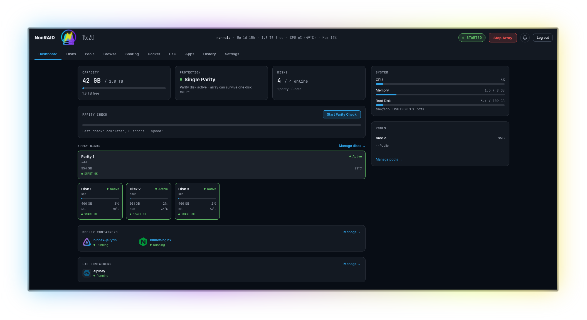
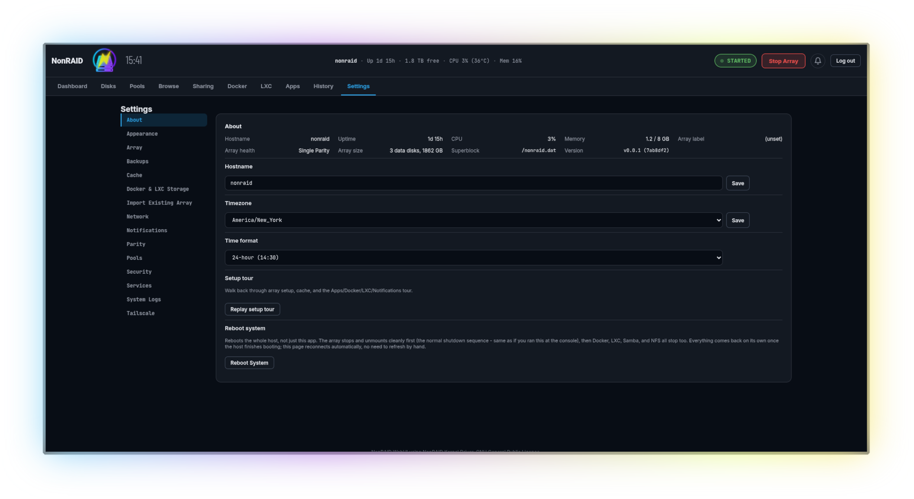

# NonRAID WebUI

<p align="center"></p>

<p align="center"></p>

### Disclaimer: **$\color{red}{\textsf{EXPERIMENTAL!}}$ HAVE ANOTHER BACKUP OF YOUR DATA!**

**Not responsible for loss of data!**

**Also backup your superblock dat file beforehand!**

**This will overwrite node/npm, samba, nfs, and pin your kernel. Recommended to have a fresh install or NonRAID OS**

## Notes

- **This webui was AI coded.** There's no way I would have had the time to code this by hand.
- The backbone nonraid kernel driver from [qvr/nonraid](https://github.com/qvr/nonraid) is based on the unraid kernel driver, not AI coded.
- The nonraid tool (nmdctl) was written by [qvr](https://github.com/qvr/nonraid)
- I am using my own [fork](https://github.com/domgregori/nonraid) of nonraid that has fixes to the nmdctl tool, the service files, and to the driver.
- Logo was designed by me.
- I have been testing this on a real metal rig at every step.

This is a web dashboard for [NonRAID](https://github.com/qvr/nonraid) - an alternative to Unraid NAS. Surfaces array status, parity protection, per-disk detail, shares, users, Docker
containers, LXC containers, historical metrics, and array management. It also builds and installs a forked nonraid 

## Features

- Parity (allows for 1 or 2 disk failures)
- Storage disk (up to 28 non matching disks)
- Wizard to setup or import an array
- A mirrored pair of cache disks with scheduled moving to array
- Dashboard with up-to-date info
- Disks menu to easily add parity, storage, and cache disks
- Create pools for storage and sharing
- Users for sharing shares via samba/nfs
  - Groups are supported
- A file browser to browse, search, upload, edit, view
- Docker template **Apps** from [Community Applications](https://github.com/Squidly271/community.applications)
- Custom docker containers
- LXC containers with snapshot support
- Choose where to store containers
- History graphs of Temps, CPU, RAM, I/O, Net, Usage
- Import an Unraid array or a previous NonRAID array/config
- Services management
- System log viewer
- Schedule automatic parity checks
- Scheduled local and remote backups with rclone
- Apprise notifications
- http, https self signed, or import cert/key
- Tailscale service. Can use custom login-server such as Headscale
- 2FA: TOTP, Passkey when using https
- Home Assistant addon via HAKS. Found [here](https://github.com/domgregori/nonraid-ha)
- Public share links to dirs/files via cloudflare tunnel
    * Safety measures taken can be read about [here](SHARE-SERVER-SAFETY.md)
- Update via webui from github releases
- *If boot disk is btrfs*, automatic system snapshot before update and added to grub menu for recovery
- `nwctl` nonraid-webui cli/tui
- No telemetry!

## TODO
- Adding disk operations to a queue currently has bugs
- Removing a disk, i.e. shrinking the array disk number has bugs
- LUKS support is being worked on on the [luks branch](https://github.com/domgregori/nonraid-webui/tree/luks-support)

## Requirements

- Debian 13 new install
  - Boot disk should be btrfs
  - NonRAID driver has specific kernel needs.
  - Not tested on other distros. Install script won't work.
  - **Not meant to install alongside anything else.** Although the install script should work on an already existing debian 13 system, it hasn't been tested
- Install script installs the other requirements. Read [REQUIREMENTS.md](REQUIREMENTS.md) and [install-webui.sh](tools/install-webui.sh)

## Installing

```
git clone https://github.com/domgregori/nonraid-webui
cd nonraid-webui
# please give the script a read before running
sudo bash tools/install-webui.sh
```

Or get the NonRAID OS iso at [domgregori/nonraid-os releases](https://github.com/domgregori/nonraid-os/releases) and run as a fresh install.

## Development

### Frontend

```bash
npm install
npm run dev
```

### Backend

```bash
cd backend
npm install
npm run dev   # http://localhost
```

Run both, then open the frontend. The backend runs as root (`nmdctl`/Docker/`smartctl`/
`useradd`/`smbpasswd`/... all need it) — no privilege drop, no sudoers rule. For a real
end-to-end test environment (real kernel driver, real array, real Samba/NFS), use a VM — see the main
`nonraid` repo's development docs.

### Share Links stack

Only needed if you're working on the Share Links feature (internet file sharing via a Cloudflare
Tunnel) - the two commands above are enough for everything else. Three more independently-runnable
pieces:

```bash
cd packages/shared && npm install && npm run build   # build first - see below
cd share-server && npm install && npm run dev
cd public-share && npm install && npm run dev
```

`packages/shared` (`@nonraid/shared`) has to be built *before* the backend or `share-server` can
resolve it - both consume it as a `file:` dependency pointing at its compiled `dist/`, not its
source, so skipping this build step surfaces as an unresolved-module error in either process
instead. Rebuild it again after pulling in any change to `packages/shared` itself.

See `backend/API.md` for the full API reference; config is plain environment variables, see each
module's own `str(...)`/`num(...)` calls in `backend/src/config.ts`.

## Project layout

```
src/
  types/       domain types (Disk, Parity, Container, Settings, ...) +
               nmdApi.ts/dockerApi.ts/sharesApi.ts/usersApi.ts/systemApi.ts/rcloneApi.ts (mirror
               the backend's wire types)
  api/         fetch wrappers for the backend (nmdApi, dockerApi, smartApi, sharesApi, usersApi,
               systemApi, rcloneApi)
  state/       AppStoreProvider (settings + Grafana URL, local-only) and
               ArrayStatusProvider (polls the backend for array/parity/disk/temp state,
               owns disk-detail selection — this is the real one)
  hooks/       useDockerContainers, useLxcContainers, useShares, useUsers, useGroups,
               useSystemStats — polling hooks with create/update/remove actions where relevant
  selectors/   pure derivation functions (backend response -> view models)
  components/  layout, dashboard, disk-detail, shares (create/edit form), users (add-user modal,
               groups modal, per-user detail panel with share-access grid), settings (backup/
               recovery/rclone remote forms, boot snapshots, notifications, TLS, ...),
               browse (ShareLinkModal, MediaViewer, EditFileDialog, bulk copy/move/delete, ...),
               shared UI primitives
  pages/       one component per route
  styles/      CSS token file + per-area stylesheets
  i18n/        react-i18next setup + per-namespace locale JSON (src/i18n/locales/en/*.json) - every
               piece of UI text goes through t(), not a literal string
  utils/       format.ts (units/dates for display) + webauthnSupport.ts (passkey capability checks)
               + mediaKind.ts (client-side image/video/audio/PDF hint for Browse's inline viewer)
               + notificationLinks.ts + simpleMarkdown.tsx
  assets/      static images (logo, etc.)

backend/                 Express API wrapping nmdctl, Docker, lxc-*, smartctl, shares, users, and
                         system stats
  src/nmd/         NmdClient interface + RealNmdClient (shells out to nmdctl)
  src/docker/      DockerClient interface + RealDockerClient (dockerode)
  src/lxc/         LxcClient interface + RealLxcClient (shells out to lxc-ls/lxc-info/lxc-create/
                   ...) + configFile.ts (line-based get/set against a container's real config
                   file — its only metadata store) + statsPoller.ts (poll-and-cache CPU/mem/IPs)
  src/smart/       SmartClient interface + RealSmartClient (smartctl) + caching service
  src/shares/      ShareStore (owns shares.json) + ShareAccessStore (owns share-access.json,
                   per-user/group SMB permissions) + ShareApplier interface (mergerfs/Samba/NFS)
                   + ShareService (orchestrates all three)
  src/users/       UsersClient interface + RealUsersClient (shells out to useradd/smbpasswd/etc.,
                   host /etc/passwd+/etc/group as source of truth) + UsersService +
                   backupExport.ts (managed users/groups + shadow-hash snapshot for config backups)
  src/system/      SystemStatsService (host CPU/memory) + the Local Backups system (backupCatalog/
                   backupScheduler/backupStream/backupCrypto/backupMeta/configRestore) + boot disk
                   snapshots (bootSnapshots.ts, btrfs + GRUB rescue menu) + hostConfig (hostname/
                   timezone/reboot) + hdparm (spin-down timers) + services.ts (managed systemd
                   units, including the sshd toggle) + sshKeys.ts (authorized_keys management) +
                   logs.ts (journalctl tailing) + benchmark.ts
  src/rclone/      RcloneClient interface + RealRcloneClient (talks to rclone's own `rclone-rcd` RC
                   daemon over HTTP - no local copy of remote definitions) + RcloneService (sync
                   job scheduling/retention/restore) + syncJobStore.ts (this app's own sync-job
                   records, separate from rclone's remotes)
  src/settings/    app settings store (settings.json), notification catalog/dispatch (Apprise),
                   schedule matching, backup-encryption password handling
  src/update/      UpdateScheduler - checks for and applies nonraid-webui/driver updates
  src/unraidImport/ parser.ts/cfgParser.ts/dockerTemplateParser.ts/archive.ts - reads an Unraid
                   config backup archive (users/shares/Docker CA apps) for the Import wizard
  src/routes/      one file per resource group - see backend/API.md for the full, current route
                   reference; this list goes stale the moment a route file is added and isn't worth
                   duplicating by hand
  src/auth/        session cookies, password hashing, login rate limiting, request-origin
                   detection (for the Secure cookie flag and passkey RP ID)
  src/tls/         built-in HTTPS: self-signed cert generation, imported cert inspection, TLS
                   enable/disable state
  src/apps/        the Apps catalog (Community Applications feed) backing one-click Docker installs
  src/browse/      the file browser (list/upload/rename/copy/move/delete under /mnt)
  src/cache/       cache pool mount, and the scheduled mover that drains cache onto the array
  src/metrics/     CPU/memory/disk/network sampling + the SQLite store behind the History graphs
  src/parity/      scheduled parity check trigger
  src/activity/    the Dashboard/History activity log (event store + file watcher)
  src/diskQueue/   the disk add/clear queue (sequences array stop/start around a disk operation)
  src/emptyDisk/   the "Empty Disk" data-eviction flow ahead of removing a disk
  src/fileMove/    move/copy primitives shared by Browse and the disk queue
  src/tailscale/   TailscaleClient interface + RealTailscaleClient (shells out to `tailscale`) -
                    status/login/logout/set, including capturing the login URL live from `tailscale
                    up`'s output for the interactive login flow
  src/shareLinks/  ShareLinkStore (sole owner of share_link.db) + ShareLinkService (creation,
                    token/password hashing) + ShareLinkRpcServer - the narrow Unix-socket RPC
                    boundary share-server (below) talks to instead of ever opening that database
                    file itself; see backend/API.md's "Share Links" section for the full design
  src/cloudflared/ CloudflaredClient interface + RealCloudflaredClient (shells out to `cloudflared`)
                    + tokenStore.ts (the tunnel token's own 0600 EnvironmentFile, never
                    settings.json) - status/enable/token for the public transport share links go
                    out over

packages/shared/         `@nonraid/shared` - path-sandbox (the traversal/symlink-escape sandboxing
                          extracted out of backend/src/browse/paths.ts, which is now a thin wrapper
                          over it), signed-payload (the generic signing core behind backend/src/
                          auth/crypto.ts's session/2FA cookies, reused by share-server's own
                          independently-secreted unlock cookie), text-file-guard (the size cap/
                          binary-detection rules backend/src/browse/service.ts's text editor
                          enforces, now shared so share-server's editable-mode editor can't drift
                          from them), media-kind (the image/video/audio/PDF extension allowlist
                          behind both backend's and share-server's `GET .../view` - the
                          authoritative Content-Type decision, deliberately excluding SVG/HTML-
                          adjacent formats so a maliciously named file can't be served inline as
                          same-origin HTML), and share-link-rpc (typed request/response shapes
                          only, no runtime logic) for the RPC protocol between backend/src/
                          shareLinks/ and share-server below. Consumed as a `file:` dependency -
                          this repo has no workspace tooling.

share-server/            The Share Links feature's own public-facing process, deliberately separate
                          from backend/ above - runs as its own unprivileged OS account with zero
                          filesystem access to share_link.db, reachable from the internet only
                          through a Cloudflare Tunnel in front of it. Talks to backend/src/
                          shareLinks/'s RPC server over a local Unix socket for share metadata
                          instead - see backend/API.md's "Share Links" section for the full design
                          and this process's own public route reference.

public-share/            The minimal frontend share-server serves to a share link's visitors - a
                          separate, much smaller Vite+React build from src/ above (no react-router,
                          no i18next), so there's no admin route or secret to audit out of what a
                          visitor's browser actually loads.
```
