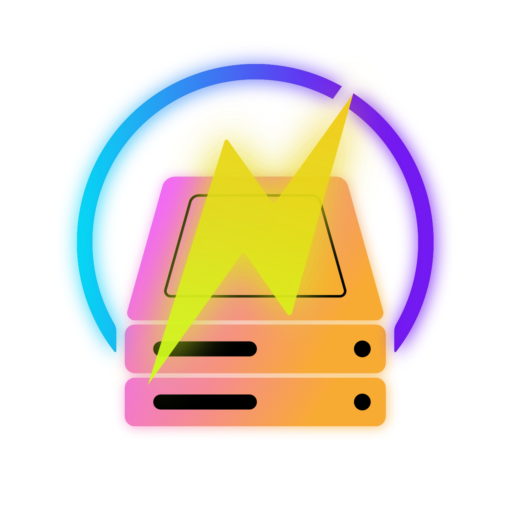

# NonRAID WebUI

<center></center>

### Disclaimer: **$\color{red}{\textsf{EXPERIMENTAL!}}$ HAVE ANOTHER BACKUP OF YOUR DATA!**

- **This webui was AI coded.**
- The backbone nonraid kernel driver from [qvr/nonraid](https://github.com/qvr/nonraid) is based on the unraid kernel driver, not AI coded.
- The nonraid tool (nmdctl) was written by [qvr](https://github.com/qvr/nonraid)
- I am using my own [fork](https://github.com/domgregori/nonraid) of nonraid that has fixes to the nmdctl tool, the service files, and one fix to the driver.

This is a web dashboard for [NonRAID](https://github.com/qvr/nonraid) - an alternative to Unraid NAS. Surfaces array status, parity protection, per-disk detail, shares, users, Docker
containers, LXC containers, historical metrics, and array management.

## Features

- Parity (allows for 1 or 2 disk failures)
- Storage disk (up to 28 non matching disks)
- Wizard to setup or import an array
- A mirrored pair of cache disks with scheduled moving to array
- Dashboard with up-to-date info
- Disks menu to easily add parity, storage, and cache disks
- Create pools for storage and sharing
- Users for sharing shares via samba/nfs
  - Groups are supported
- A file browser to interact with shares
- Docker template **Apps** from [Community Applications](https://github.com/Squidly271/community.applications)
- Custom docker containers
- LXC containers with snapshot support
- Choose where to store containers
- History graphs of Temps, CPU, RAM, I/O, Net, Usage
- Import an Unraid array or a previous NonRAID array/config
- Service management
- System log viewer
- Schedule automatic parity checks
- Automatic config backups
- Apprise notifications
- http, https self signed, or import cert/key
- 2FA: TOTP, Passkey when using https

## Requirements

- Debian 13 new install
  - NonRAID has specific kernel needs
  - Not tested on other distros. Only tested on fresh install of Debian 13
- Install script installs the other requirements. Read [REQUIREMENTS.md](REQUIREMENTS.md) and [install-webui.sh](tools/install-webui.sh)

## Installing

```
git clone https://github.com/domgregori/nonraid-webui
cd nonraid-webui
sudo bash tools/install-webui.sh
```

## Development

### Frontend

```bash
npm install
npm run dev
```

### Backend

```bash
cd backend
npm install
npm run dev   # http://localhost:3001
```

Run both, then open the frontend. Users
needs root (`useradd`/`smbpasswd` family) — see `backend/README.md`'s Privileges section. For a real
end-to-end test environment (real kernel driver, real array, real Samba/NFS), use a VM — see the main
`nonraid` repo's development docs.

See `backend/README.md` for the API and configuration.

## Project layout

```
src/
  types/       domain types (Disk, Parity, Container, Settings, ...) +
               nmdApi.ts/dockerApi.ts/sharesApi.ts/usersApi.ts/systemApi.ts (mirror the backend's
               wire types)
  api/         fetch wrappers for the backend (nmdApi, dockerApi, smartApi, sharesApi, usersApi,
               systemApi)
  state/       AppStoreProvider (settings + Grafana URL, local-only) and
               ArrayStatusProvider (polls the backend for array/parity/disk/temp state,
               owns disk-detail selection — this is the real one)
  hooks/       useDockerContainers, useLxcContainers, useShares, useUsers, useGroups,
               useSystemStats — polling hooks with create/update/remove actions where relevant
  selectors/   pure derivation functions (backend response -> view models)
  components/  layout, dashboard, disk-detail, shares (create/edit form), users (add-user modal,
               groups modal, per-user detail panel with share-access grid), shared UI primitives
  pages/       one component per route
  styles/      CSS token file + per-area stylesheets
  utils/       format.ts (units/dates for display) + webauthnSupport.ts (passkey capability checks)
  assets/      static images (logo, etc.)

backend/                 Express API wrapping nmdctl, Docker, lxc-*, smartctl, shares, users, and
                         system stats
  src/nmd/         NmdClient interface + RealNmdClient (shells out to nmdctl)
  src/docker/      DockerClient interface + RealDockerClient (dockerode)
  src/lxc/         LxcClient interface + RealLxcClient (shells out to lxc-ls/lxc-info/lxc-create/
                   ...) + configFile.ts (line-based get/set against a container's real config
                   file — its only metadata store) + statsPoller.ts (poll-and-cache CPU/mem/IPs)
  src/smart/       SmartClient interface + RealSmartClient (smartctl) + caching service
  src/shares/      ShareStore (owns shares.json) + ShareAccessStore (owns share-access.json,
                   per-user/group SMB permissions) + ShareApplier interface (mergerfs/Samba/NFS)
                   + ShareService (orchestrates all three)
  src/users/       UsersClient interface + RealUsersClient (shells out to useradd/smbpasswd/etc.,
                   host /etc/passwd+/etc/group as source of truth) + UsersService
  src/system/      SystemStatsService (host CPU/memory via Node's os module)
  src/routes/      /api/status, /api/array/*, /api/parity/*, /api/docker/*, /api/lxc/*,
                   /api/smart/*, /api/shares/*, /api/users/*, /api/groups/*, /api/system
  src/auth/        session cookies, password hashing, login rate limiting, request-origin
                   detection (for the Secure cookie flag and passkey RP ID)
  src/tls/         built-in HTTPS: self-signed cert generation, imported cert inspection, TLS
                   enable/disable state
  src/apps/        the Apps catalog (Community Applications feed) backing one-click Docker installs
  src/browse/      the file browser (list/upload/rename/copy/move/delete under /mnt)
  src/cache/       cache pool mount, and the scheduled mover that drains cache onto the array
  src/metrics/     CPU/memory/disk/network sampling + the SQLite store behind the History graphs
  src/parity/      scheduled parity check trigger
  src/settings/    app settings store, notification catalog/dispatch (Apprise), schedule matching
  src/activity/    the Dashboard/History activity log (event store + file watcher)
  src/diskQueue/   the disk add/clear queue (sequences array stop/start around a disk operation)
  src/emptyDisk/   the "Empty Disk" data-eviction flow ahead of removing a disk
  src/fileMove/    move/copy primitives shared by Browse and the disk queue
```
